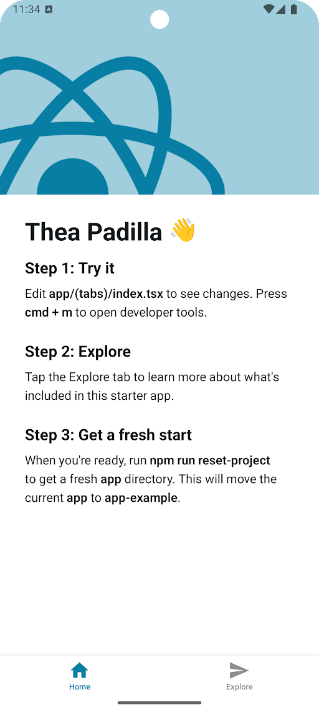  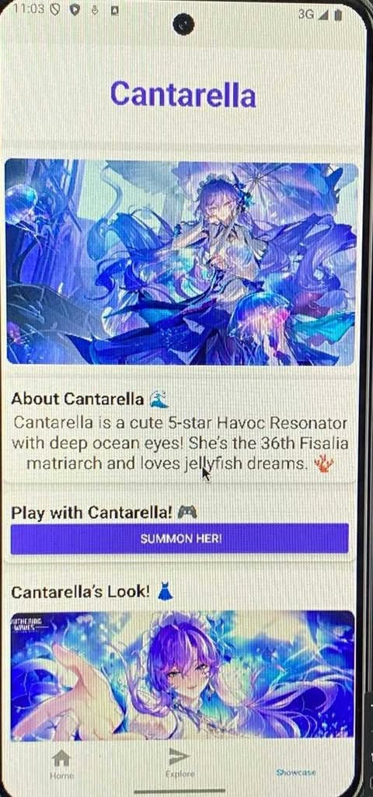 
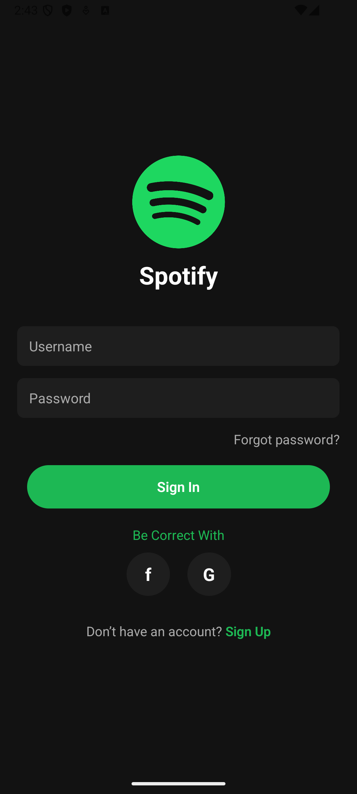
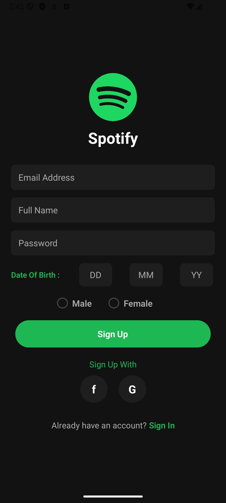
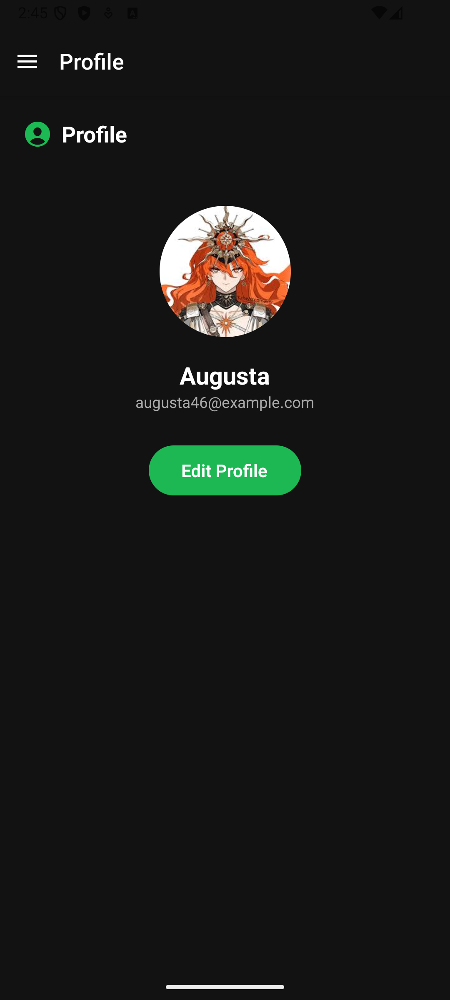
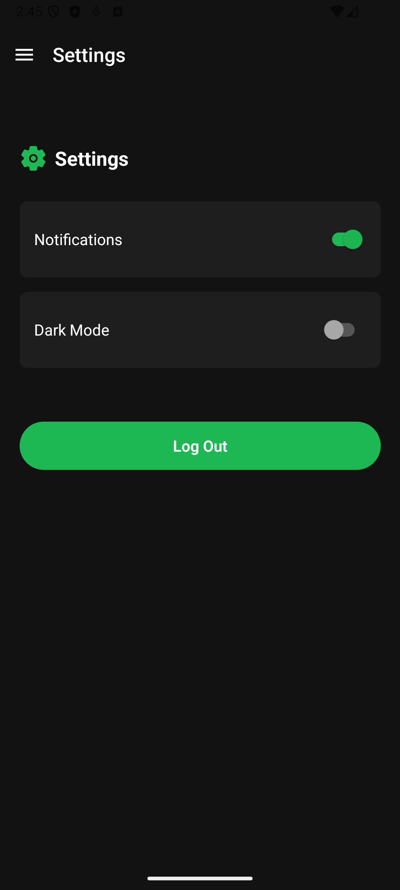
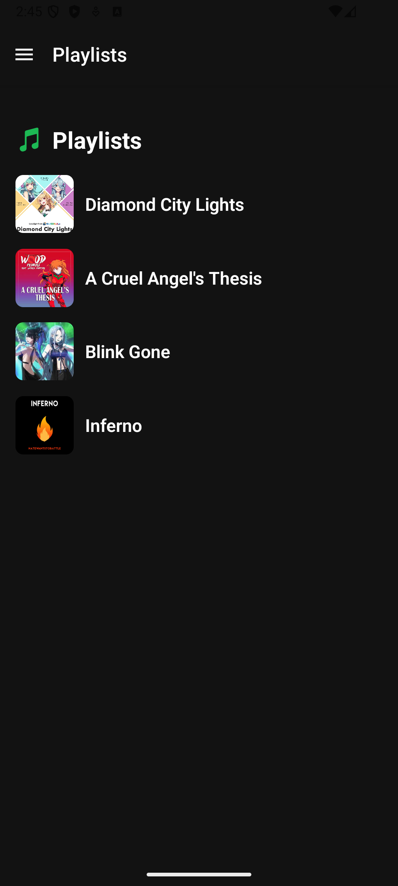

# WEEK 4
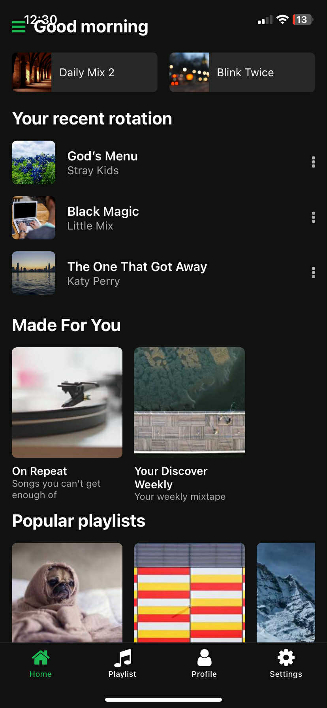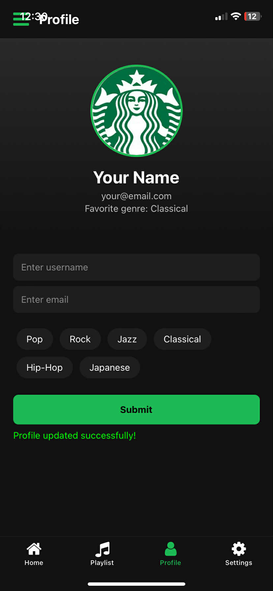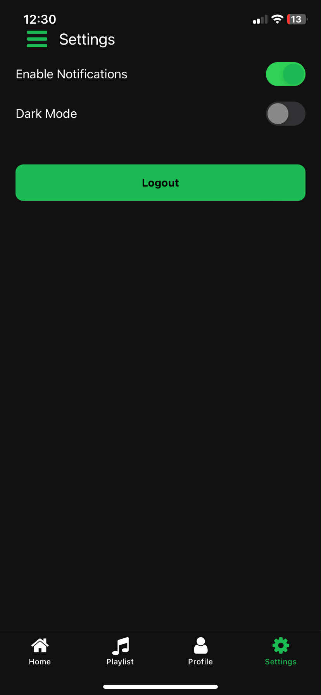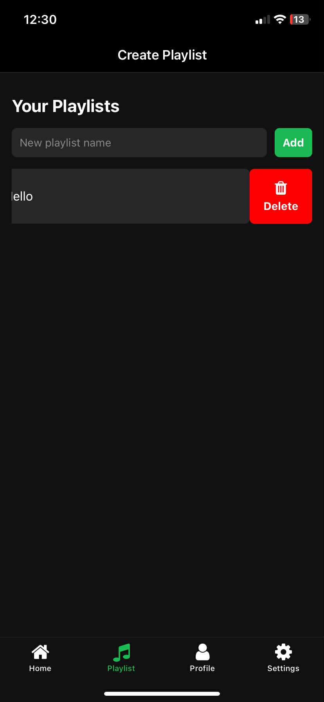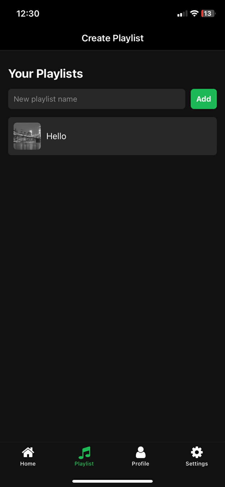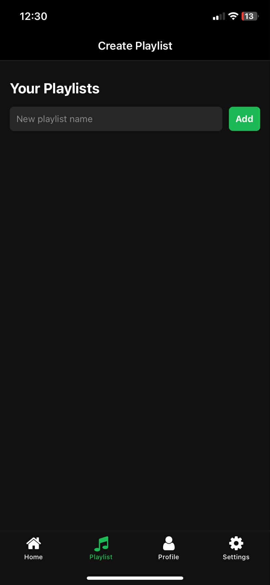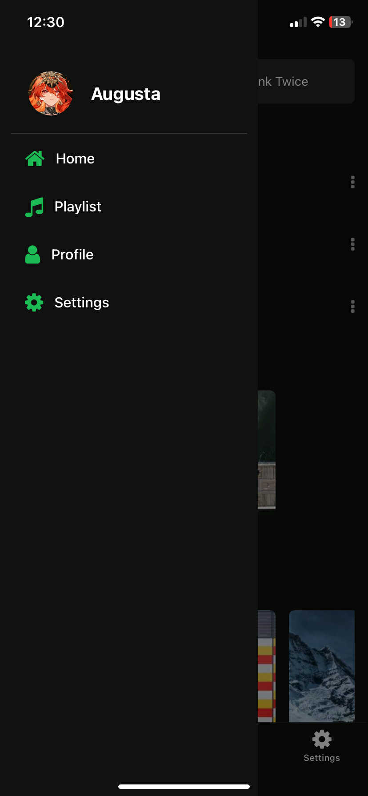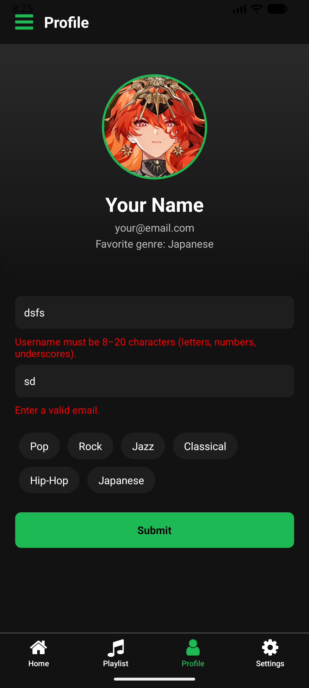

# WEEK 5
I added light, dark, and custom themes to the app using Redux and redux-persist. I can pick a theme or choose a custom accent color. The selected theme is saved so it stays even after closing the app. All screens update automatically to match the theme I chose.
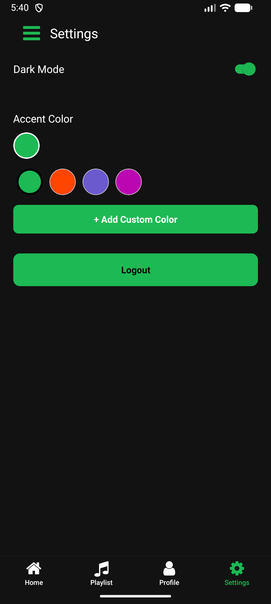
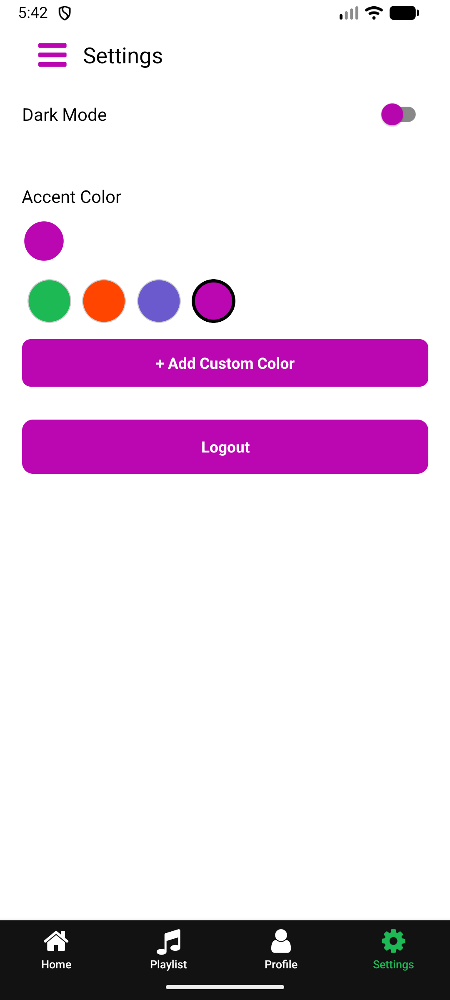
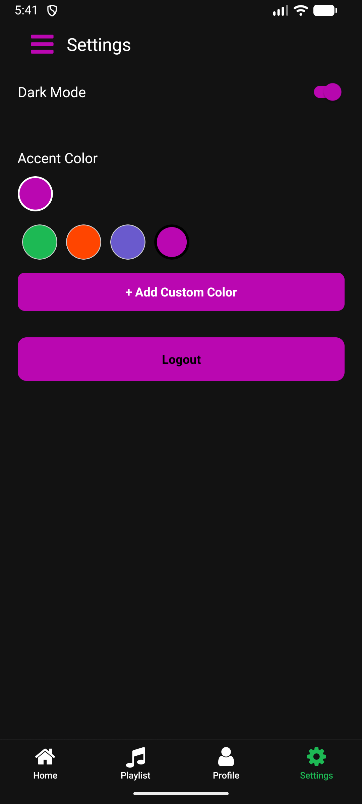
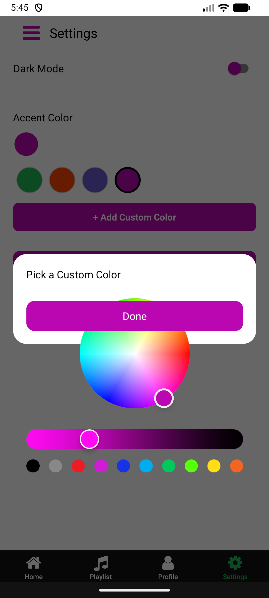
